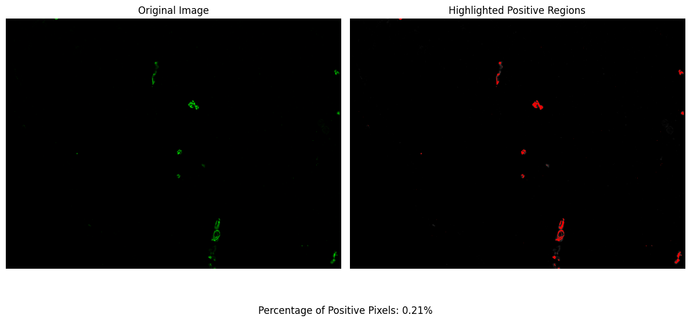

# 🎯 Quick Start Guide


In this tutorial, we will guide you through the process of using the Pixel Partitioner package to identify and quantify the presence of specific markers in single-layer TIFF images. This package applies multi-class Otsu thresholding to distinguish positive pixels and allows for the adjustment of the classification threshold to suit your specific needs. Let's dive into the step-by-step guide on how to use Pixel Partitioner.


```python
# let's import the package
import pixelpartitioner as pp
```

### Step 1: Find the Image Files to Process

The first step involves identifying and gathering all the TIFF images you wish to analyze. This is achieved by specifying the folder path where your images are stored. Here is how you do it:


```python
# Change to the directory that contains YOUR data
folderPath = '/Users/aj/Dropbox (Partners HealthCare)/nirmal lab/softwares/pixelpartitioner/tests/data'
```


```python
imagePaths = pp.getImages(folderPath=folderPath, extension='tif')
```

In this code snippet, `getImages` is a function that scans the specified `folderPath` for all files with the '.tif' extension and returns a list of paths to these images. This list (`imagePaths`) will then be used as input for the Pixel Partitioner.

### Step 2: Applying OTSU Thresholding

Once you have all the image paths, you can proceed to apply the OTSU thresholding algorithm to identify the positive pixels for the given marker. The Pixel Partitioner package automates this process and adjusts the classification based on the background noise, ensuring accurate segmentation.


```python
# Change for YOUR data
outputFolder = '/Users/aj/Downloads/' # change to the location where you would like to save your results
percentPositiveThreshold = 5 # this says that the positive pixels should not exceed 5% (adjust as needed according to the marker)
```


```python
results_df = pp.PixelPartitioner(imagePaths=imagePaths, 
                              outputFolder=outputFolder, 
                              percentPositiveThreshold=percentPositiveThreshold)
```

    Performing OTSU Thresholding with 2 classes
    ---------------------------------------------
    Master DataFrame saved to: /Users/aj/Downloads/results/master_results.csv
    Thresholded Images saved to: /Users/aj/Downloads/


Here, `PixelPartitioner` is the core function of the package. It takes the list of image paths (`imagePaths`), the output folder path (`outputFolder`) where the results and modified images will be saved, and the `percentPositiveThreshold`. This threshold determines the sensitivity of the classification process, with the default set to 5%. The function returns a DataFrame (`results_df`) containing detailed information about the analysis, including the percentage of positive pixels identified in each image.

Importantly, the images with the positive pixels identified and overlaid will be saved in the `outputFolder`. We highly encourage you to review these modified images to assess the performance of the method. Although it is not necessary to inspect every single image, examining a subset is crucial to ensure that the segmentation and classification have been conducted accurately. This visual inspection allows you to confirm the effectiveness of the Pixel Partitioner in identifying the marker of interest and provides an opportunity to adjust parameters or exclude challenging images from the analysis if necessary.

### Step 3: Helper Plotting Function

To visualize the percentage of positive pixels in a specific image, you can use the `plotPixel` function. This function generates a plot displaying the distribution of positive pixels across different classes, providing a visual insight into the classification results.


```python
# Change for YOUR data
imagePath = '/Users/aj/Dropbox (Partners HealthCare)/nirmal lab/softwares/pixelpartitioner/tests/data/image_1.tif'
```


```python
pp.plotPixel(imagePath=imagePath, num_classes=2)
```


    

    


In this example, `plotPixel` takes the path to a specific image (`imagePath`) and the number of classes (`num_classes`) as parameters. The `num_classes` parameter should match the classification used during the thresholding process. This will produce a plot for the specified image, allowing for a quick assessment of the segmentation quality.

### Conclusion

By following these steps, you can effectively use the Pixel Partitioner package to analyze single-layer TIFF images, identify positive pixels for specific markers, and quantify their presence with precision. The package's flexibility in adjusting the percent positive threshold and its ability to visually validate the results make it a valuable tool for researchers working with imaging datasets.

Remember, the visual output and the generated CSV file provide comprehensive insights into the segmentation process, enabling you to fine-tune the analysis parameters or exclude challenging images to achieve the desired accuracy in marker quantification.


```python

```


```python

```
